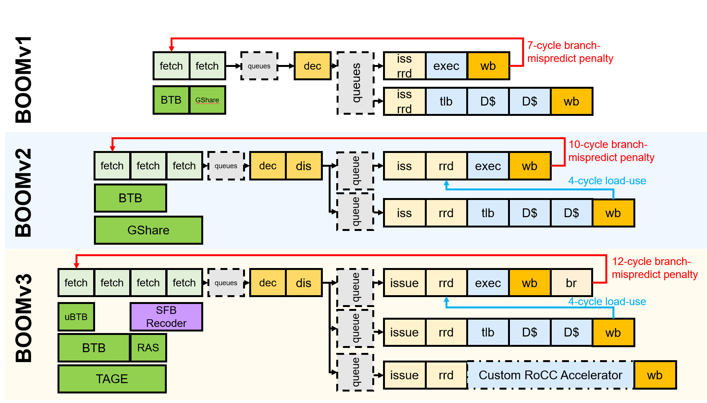
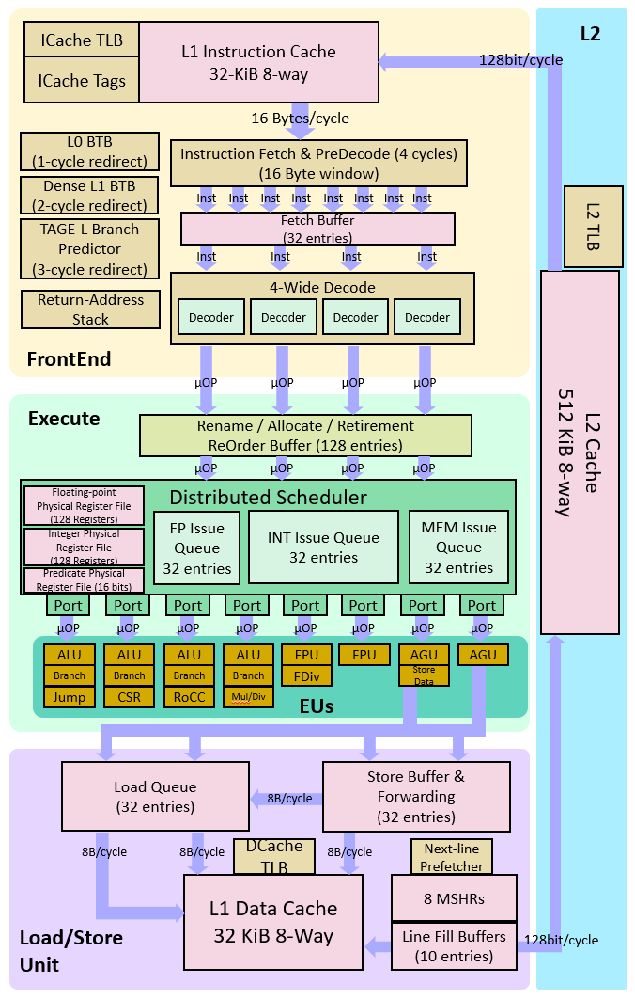

# SpecLFB-SonicBOOM
This folder contains the source code of SpecLFB implemented in the [SonicBOOM](https://github.com/riscv-boom/riscv-boom).




The Berkeley Out-of-Order RISC-V Processor [](https://circleci.com/gh/riscv-boom/riscv-boom)
====================================================================================================================================================================

The Berkeley Out-of-Order Machine (BOOM) is a synthesizable and parameterizable open source RV64GC RISC-V core written in the [Chisel](https://chisel.eecs.berkeley.edu/) hardware construction language.
Created at the University of California,
Berkeley in the [Berkeley Architecture Research](https://bar.eecs.berkeley.edu/) group, its focus is to create a high performance, synthesizable, and parameterizable core for architecture research.
The current version of the BOOM microarchitecture ([SonicBOOM, or BOOMv3](https://carrv.github.io/2020/papers/CARRV2020_paper_15_Zhao.pdf)) is performance competitive with commercial high-performance out-of-order cores, achieving 6.2 CoreMarks/MHz.




Feature | BOOM
--- | ---
ISA | RISC-V (RV64GC)
Synthesizable |√
FPGA |√
Parameterized |√
IEEE 754 Floating Point |√
Atomics |√
Caches |√
Virtual Memory |√
Boots Linux |√
Runs SPEC |√
CoreMark/MHz |6.2

## IMPORTANT: Using BOOM
This repository is **NOT A SELF-RUNNING** repository. To instantiate a BOOM core, please use the
[Chipyard](https://github.com/ucb-bar/chipyard) SoC generator.

The current hash of Chipyard that works with this repository is located in the `CHIPYARD.hash`
file in the top level directory of this repository. This file is mainly used for CI purposes, since
Chipyard should follow the correct version of rocket-chip. For most users, you should be able to
clone Chipyard separately and follow the default Chipyard instructions (without having to use the `.hash` file).

While BOOM is primarily ASIC-optimized, it is also usable on FPGAs.
Chipyard provides infrastructure and documentation for deploying BOOM on AWS F1 FPGAs through FireSim.


## SpecLFB Major changes in the SonicBOOM.

We made major changes in `src/main/scala/exu` and `src/main/scala/lsu`, `git grep -il speclfb` should reveal most/all of the files we changed.


## How to run the SonicBOOM core enhanced with SpecLFB?

Make sure chipyard 1.8.0 is installed in your working environment, and perform the following operations in the `chipyard` document

* Step1: Replace original BOOM core `boom` in the `\generator`  with  SonicBOOM core enhanced with SpecLFB.                                                                     

* Step2: Add configuration related to SonicBOOM core enhanced with SpecLFB in the file `\generator\chipyard\src\mian\scala\config\BoomConfigs.scala`.

```
class MediumBoomSpeclfbConfig extends Config(
  new boom.common.WithNMediumSpeclfb(1) ++                         // medium boom config
  new chipyard.config.AbstractConfig)  
```

* Step3: Compile the cores.
  * ```
    cd sims/verilator
    ```
  * ```
    make CONFIG=MediumBoomConfig
    ``` 
    or  
    ```
    make CONFIG=MediumBoomSpeclfbConfig
    ```

     `MediumBoomConfig` corresponds to the original SonicBOOM. 
     
     `MediumBoomSpeclfbConfig` corresponds to the SonicBOOM enhanced with SpecLFB.

* Step4: Run the attack on the executable binary corresponding to the compiled core.

  ```
  ./simulator-chipyard-MediumBoomSpeclfbConfig $ATTACK_HOME/spectre-v1.riscv`
  ```
  `$ATTACK_HOME` refers to the path where the executable file for the attack is located.

